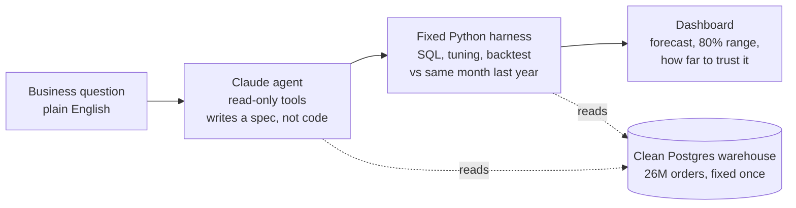

# demand-on-demand

**Ask for a demand forecast in plain English. Get a tested forecast and dashboard in under a minute.**

A business user types a question like *"monthly forecast of Tito's minis in Des Moines for the next 5 months"*.
A single Claude agent (the Claude API, Claude Sonnet 5) turns the words into a precise request against a
company-style Postgres warehouse of 26 million Iowa liquor orders (2016 to 2026). A fixed Python harness then builds
the monthly series, tunes and tests the models against the simplest honest benchmark, the same month last year, and
publishes a dashboard that says how far to trust the answer.

| | |
|---|---|
| Plain English to dashboard | about 40 seconds (median of the three examples: 20 s agent, 18 s harness) |
| Claude API cost per request | about $0.02 |
| Forecast accuracy | beats "same month last year" on 23 of 30 sampled forecasts; median error 12% lower |
| Agent accuracy | 42 of 42 eval runs resolved the request exactly or correctly declined it |

**Author:** Joseph M. Hahn, Ph.D., independent AI and machine learning consultant  
[jmh-datasciences.com](https://jmh-datasciences.com) · [LinkedIn](https://www.linkedin.com/in/hahnjoe) · jmh.datasciences@gmail.com  
**Built end-to-end with Claude Code.** · **License:** [MIT](#license-and-data)

## How it works



**The AI decides what to forecast; code decides how.** The agent has five read-only tools: search names,
run one checked SELECT, preview a spec, ask one clarifying question, submit. It resolves "Tito's minis" to the right
products, "Des Moines" to the city, "revenue" to dollars and "next quarter" to 3 months, then hands over a spec. It
never writes the aggregation SQL, the train/test split, the metrics or the charts; those are fixed code, the same for
every request. A second short Claude call writes the dashboard summary, using only numbers the harness computed.

**Honest accuracy.** Every forecast is backtested on the last 24 months, which no choice ever saw. Settings are
tuned on the two years before: 96 configurations (LightGBM and ridge; level, month-over-month or year-over-year
targets; with or without learning from the same product in other counties), then the single best or the average of
the top three, blended with "same month last year" only as far as that helps. The baseline is always a candidate, so a
model is used only when it beats it.

**Clean data, fixed once.** The public data has real problems, documented on the
[data exploration page](https://joehahn.github.io/demand-on-demand/data_exploration.html): the state's export repeats
1.5 million rows; category codes were reassigned in 2016 and a category was recoded in 2022; 254 products were
renumbered; a sleeve of 12 minis is counted as one bottle; liters were rounded down to whole liters for three
months; cities are spelled several ways. The loader fixes each one once, in the warehouse, and the
[data fixes page](https://joehahn.github.io/demand-on-demand/data_fixes.html) shows before and after. No forecast
has to know these problems existed.

**Least privilege.** Postgres runs with password authentication and separate roles. The agent's login can only read
the clean tables, with a query time limit. Credentials live in `.env`, are read by Python, and never appear in a prompt.

## See it live

- **[Landing page](https://joehahn.github.io/demand-on-demand/)**: the idea in one screen, with the three example forecasts.
- **[Data exploration](https://joehahn.github.io/demand-on-demand/data_exploration.html)**: what 26 million orders look like: volume by day, month and
  year, seasonality (flat statewide, 3x to 8x swings in slices like cream liqueurs and gift packs), and every data
  problem found while loading.
- **[Data fixes](https://joehahn.github.io/demand-on-demand/data_fixes.html)**: each problem, the fix applied once in the warehouse, and before and after.
- **[Data dictionary](https://joehahn.github.io/demand-on-demand/data_dictionary.html)**: every table and column, exactly as the
  agent is told about them at the start of each request (written once in `load_data.py`, stored as database comments).

**Example forecasts.** Each was made by the agent from the plain-English request shown. Each dashboard is one page
with how the request was read, the forecast chart and table (with an 80% range), the backtest against "same month last
year" by months ahead, the table the model learns from, a map of the stores included, the 96 model configurations
compared, every tool call the agent made, and the exact spec and SQL that ran.

| request | backtest vs same period last year |
|---|---|
| [Monthly forecast of Tito's minis in Des Moines for the next 5 months](https://joehahn.github.io/demand-on-demand/examples/tito_s_minis_des_moines_next_5_months.html) | 8% more accurate |
| [What revenue should we expect from Fireball in Linn County next quarter?](https://joehahn.github.io/demand-on-demand/examples/fireball_linn_county_next_quarter.html) | 9% more accurate |
| [How many bottles of cream liqueur will Iowa stores order for the holidays?](https://joehahn.github.io/demand-on-demand/examples/cream_liqueur_holidays.html) | 29% more accurate |
| [show me weekly forecast of Cream liqueur bottles sold across all of iowa, twelve weeks out](https://joehahn.github.io/demand-on-demand/examples/cream_liqueur_by_week_next_12_weeks.html) | as accurate (vs the same week last year)* |

\*A weekly forecast from the [on-the-fly prototype](https://joehahn.github.io/demand-on-demand/onthefly.html): the AI writes the SQL for the daily history,
and fixed code buckets it into weeks, models it, and cross-checks the AI's data against the tested monthly path.

Not every forecast beats last year: the [benchmark report](benchmark/report.md) lists all 30 sampled forecasts,
misses included, and when a model does not beat last year its dashboard says so.

**Live demo.** `python demo.py` lists canned requests to run in front of an audience (`python demo.py 3` runs one
live and opens its dashboard; `--rehearse` saves copies for `--replay` if the network fails). They are checked with
the agent evals: `python demo.py --check`.

## Results

- [benchmark/report.md](benchmark/report.md): 30 forecasts sampled from the warehouse (products, categories, vendors;
  counties and statewide; bottles, dollars, liters; 3 to 12 months). The model beat "same month last year" on 23;
  median monthly error 15.0% vs 16.0%. Iowa liquor demand is very regular year to year, so last year is a hard baseline,
  and on the other 7 it was not beaten. The report lists every forecast, the misses included.
- [evals/report.md](evals/report.md): 21 test requests, 2 runs each, scored on product, place, measure, horizon and
  breakout, plus requests that should be declined.
- [evals/grounding.md](evals/grounding.md): each dashboard's summary opens with one sentence written by Claude from the
  forecast's computed numbers (the accuracy sentence and every other number come from fixed code). This check traces
  every number in such sentences back to the computed results: 60 of 60 matched.
- [Slot filling vs AI-written SQL](https://joehahn.github.io/demand-on-demand/differential.html): the same requests given
  to an agent that writes the SQL itself (NL2SQL, `dod/nl2sql.py`), its monthly history compared with the slot-filling
  path month by month (`evals/differential.py`): 11 of 18 matched with the data dictionary alone, 17 of 18 with three
  explicit rules (`--rules`). The wrong queries ran fine but were off in older history; the test also found (and we
  fixed) a bug in the slot-filling path.
- [Forecasts by week, quarter or year](https://joehahn.github.io/demand-on-demand/onthefly.html) (prototype,
  `dod/onthefly.py`): the AI writes SQL for daily totals and names the grain; fixed code buckets, models (grain-aware
  harness, `model.use_grain`) and cross-checks the AI's data against the slot-filling path summed by month.

## Run it yourself

Needs Python 3.12, Postgres 17, about 20 GB of disk, and an Anthropic API key.

```bash
brew install postgresql@17 python@3.12 && brew services start postgresql@17
python3.12 -m venv .venv && .venv/bin/pip install -r requirements.txt
# create the database and roles (see "Database access" in CLAUDE.md), then:
cp .env.example .env          # add ANTHROPIC_API_KEY and the two Postgres connection strings
.venv/bin/python load_data.py                    # download, load, clean: about 20 minutes, 13 GB
.venv/bin/python explore_data.py && .venv/bin/python data_fixes.py
.venv/bin/python -m dod.agent "monthly forecast of Tito's minis in Des Moines for the next 5 months"
```

The dashboard lands in `out/<title>/dashboard.html`. `python -m dod.run specs/titos_polk.json` runs the harness on a
hand-written spec without the agent.

## Repo map

| path | what it does |
|---|---|
| `load_data.py` | one-time pull of Iowa Liquor Sales 2016 onward into Postgres: raw, curated star schema, Census reference tables, the clean stage, and the data dictionary |
| `explore_data.py`, `data_fixes.py`, `data_dictionary.py` | the three data pages in `docs/` |
| `dod/agent.py`, `dod/tools.py` | the Claude agent and its read-only tools |
| `dod/spec.py`, `dod/panel.py`, `dod/model.py`, `dod/dashboard.py`, `dod/run.py` | the fixed harness |
| `evals/`, `benchmark/` | agent evals, summary grounding, forecast-accuracy benchmark |
| `showcase.py` | the landing page |
| `CLAUDE.md`, `PLAN.md` | the working notes Claude Code built this from |

## About the author

I am Joseph M. Hahn, Ph.D., an independent AI and machine learning consultant. Through **JMH DataSciences** I build
production AI and machine learning systems for clients who need a real decision automated, not a demo. Before going
independent I spent eight years inside Oracle's AI Center of Excellence delivering AI systems for enterprise clients
in manufacturing, oil and gas, public sector, and retail.

This repo shows a pattern I use: let an AI agent handle the part people find tedious, turning a vague request into a
precise one, and keep everything that has to be trustworthy in fixed, tested code. If your business still builds
forecasts by hand, [let's talk](https://jmh-datasciences.com).

Related work: [chicago_crime_forecast](https://github.com/joehahn/chicago_crime_forecast) (one model for a thousand
time series) · [diplomacy-A2A](https://github.com/joehahn/diplomacy-A2A) (seven Claude agents negotiating).

## License and data

Code and writing: [MIT](LICENSE).

**Data:** [Iowa Liquor Sales](https://catalog.data.gov/dataset?q=iowa+liquor+sales), State of Iowa, via the Iowa Data
Hub, licensed [CC BY 4.0](https://creativecommons.org/licenses/by/4.0/); modified (duplicates removed, cleaned,
aggregated). County population and income: U.S. Census Bureau. Not endorsed by the State of Iowa. Brand names appear
only as they do in the public data. Raw data is not stored in this repo; `load_data.py` downloads it.
