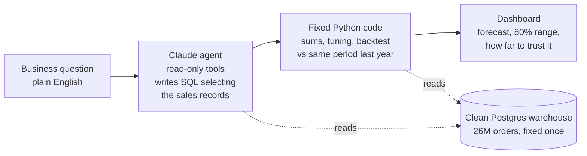

# demand-on-demand

**Ask for a demand forecast in plain English. Get a tested forecast and dashboard in under a minute.**

A business user types a question like *"monthly forecast of Tito's minis in Des Moines for the next 5 months"*.
A single Claude agent (the Claude API, Claude Sonnet 5) with read-only tools turns the words into one SQL query that
picks the right orders from a company-style Postgres warehouse of 26 million Iowa liquor orders (2016 to 2026). Fixed
Python code then adds them up by week or month, tunes and tests the models against the simplest honest benchmark, the
same period last year, and publishes a dashboard that says how far to trust the answer.

| | |
|---|---|
| Plain English to dashboard | about 30 seconds (median of the four examples) |
| Claude API cost per request | about $0.02 |
| Forecast accuracy | beats "same month last year" on 18 of 30 sampled forecasts; median error 8% lower, mean 9% lower |
| Agent accuracy | on 34 test requests run 3 times each, its SQL added up to the answer key in 102 of 102 runs |

**Author:** Joseph M. Hahn, Ph.D., independent AI and machine learning consultant  
[jmh-datasciences.com](https://jmh-datasciences.com) · [LinkedIn](https://www.linkedin.com/in/hahnjoe) · joe.hahn@jmh-datasciences.com  
**Built end-to-end with Claude Code.** · **License:** [MIT](#license-and-data)

## How it works



**The AI decides what to forecast; code decides how.** The agent has four tools: search names, run one checked
read-only SELECT, ask one clarifying question, and submit its query. It resolves "Tito's minis" to the right products,
"Des Moines" to the city and "revenue" to dollars, and writes one SQL query that selects the sales records: which
records, which measure, how to label each series. It follows three rules for the warehouse's traps and a short glossary of the
company's business definitions ("minis" are 50 ml bottles; whiskey does not include whiskey liqueur); both are part of
its instructions in [dod/agent.py](dod/agent.py), and its tools are in [dod/tools.py](dod/tools.py). Fixed code never
runs that query as is: it wraps it in its own sums, by week or month, by store and by product. The train/test split,
the metrics and the charts are fixed code too, the same for every request. A second short Claude call writes the
dashboard summary, using only numbers the models computed.

**Honest accuracy.** Every forecast is backtested on the last 24 months, which no choice ever saw. Settings are
tuned on the two years before: 48 configurations (LightGBM and ridge; level, month-over-month or year-over-year
targets; lags and history lengths), then the single best or the average of the top three, blended with "same month
last year" only as far as that helps. Every forecast, weekly or monthly, is offered the same four inputs (time of year,
business days and holidays, county population, active stores), each kept only if it helps; ridge regression sees time
of year as a smooth yearly wave (sine and cosine), LightGBM as the month number ([benchmark/menu.md](benchmark/menu.md)). The baseline is always a candidate, so a
model is used only when it beats it.

**Clean data, fixed once.** The public data has real problems, documented on the
[data exploration page](https://joehahn.github.io/demand-on-demand/data_exploration.html): the state's export repeats
1.5 million rows; category codes were reassigned in 2016 and a category was recoded in 2022; 254 products were
renumbered; a sleeve of 12 minis is counted as one bottle; liters were rounded down to whole liters for three
months; cities are spelled several ways. The loader fixes each one once, in the warehouse, and the
[data fixes page](https://joehahn.github.io/demand-on-demand/data_fixes.html) shows before and after. No forecast
has to know these problems existed.

**Least privilege.** Postgres runs with password authentication and separate roles. The agent's login can only read
the clean tables, with a query time limit. Credentials live in `.env`, are read by Python, and never appear in a prompt.

## See it live

- **[Landing page](https://joehahn.github.io/demand-on-demand/)**: the idea in one screen, with the four example forecasts.
- **[Data exploration](https://joehahn.github.io/demand-on-demand/data_exploration.html)**: what 26 million orders look like: volume by day, month and
  year, seasonality (flat statewide, 3x to 8x swings in slices like cream liqueurs and gift packs), and every data
  problem found while loading.
- **[Data fixes](https://joehahn.github.io/demand-on-demand/data_fixes.html)**: each problem, the fix applied once in the warehouse, and before and after.
- **[Data dictionary](https://joehahn.github.io/demand-on-demand/data_dictionary.html)**: every table and column, exactly as the
  agent is told about them at the start of each request (written once in `load_data.py`, stored as database comments).

**Example forecasts.** Each was made by the agent from the plain-English request shown (`python make_examples.py`).
Each dashboard is one page with how the request was read, the forecast chart and table (with an 80% range), the
backtest against the same period last year, the table the model learns from, which inputs helped, a map of the stores
included, the 48 model configurations compared, every tool call the agent made, and the exact SQL that ran.

| request | backtest vs same period last year |
|---|---|
| [Monthly forecast of Tito's minis in Des Moines for the next 5 months](https://joehahn.github.io/demand-on-demand/examples/tito_s_minis_des_moines_next_5_months.html) | 16% more accurate |
| [What revenue should we expect from Fireball in Linn County next quarter?](https://joehahn.github.io/demand-on-demand/examples/fireball_linn_county_next_quarter.html) | 12% more accurate |
| [How many bottles of cream liqueur will Iowa stores order for the holidays?](https://joehahn.github.io/demand-on-demand/examples/cream_liqueur_holidays.html) | 30% more accurate |
| [show me weekly forecast of Cream liqueur bottles sold across all of iowa, twelve weeks out](https://joehahn.github.io/demand-on-demand/examples/cream_liqueur_by_week_next_12_weeks.html) | 18% more accurate |

More by week, quarter and year: [forecasts by any grain](https://joehahn.github.io/demand-on-demand/onthefly.html).

Not every forecast beats last year: the [benchmark report](benchmark/report.md) lists all 30 sampled forecasts,
misses included, and when a model does not beat last year its dashboard says so.

**Live demo.** `python demo.py` lists canned requests to run in front of an audience (`python demo.py 3` runs one
live and opens its dashboard; `--rehearse` saves copies for `--replay` if the network fails). Their SQL is checked
against the answer key with `python demo.py --check`.

## Results

- [benchmark/report.md](benchmark/report.md): 30 forecasts sampled from the warehouse (products, categories, vendors;
  counties and statewide; bottles, dollars, liters; 3 to 12 months), run through the same fixed code as every forecast.
  The model beat "same month last year" on 18, with a median error 8% lower and a mean error 9% lower. Iowa liquor
  demand is very regular year to year, so last year is a hard baseline, and on the other 12 it was not beaten. The report lists every forecast, the
  misses included.
- [evals/sql_report.md](evals/sql_report.md): the agent's SQL scored against an answer key (`evals/answer_cases.json`,
  `evals/build_answers.py`): 34 requests (brands, categories, minis, cities, counties, a 207-store chain, weeks,
  quarters, a year, and requests it should decline), 3 runs each. The sales records its SQL selected, summed by month,
  matched the key in every month in all 102 runs, and all 102 read the grain and horizon right.
- [evals/grounding.md](evals/grounding.md): each dashboard's summary opens with one sentence written by Claude from the
  forecast's computed numbers (the accuracy sentence and every other number come from fixed code). This check traces
  every number in such sentences back to the computed results: 60 of 60 matched.
- How the agent got there: an earlier version had the AI fill in a request form and fixed code write the SQL (slot
  filling). [Comparing AI-written SQL with it](https://joehahn.github.io/demand-on-demand/differential.html) month by
  month found three warehouse traps (renumbered products, recoded categories, brand names with extra words), fixed with
  three short rules; the answer key then showed every remaining miss was a business definition, fixed with a short
  glossary (baseline 90 of 102, then 102 of 102 once the agent was also told where the data ends). Measured before slot filling was retired: pooling with other counties
  added little and unevenly ([benchmark/pooling.md](benchmark/pooling.md)), so it was dropped.

## Run it yourself

Needs Python 3.12, Postgres 17, about 20 GB of disk, and an Anthropic API key.

```bash
brew install postgresql@17 python@3.12 && brew services start postgresql@17
python3.12 -m venv .venv && .venv/bin/pip install -r requirements.txt
# create the database and roles (see "Database access" in CLAUDE.md), then:
cp .env.example .env          # add ANTHROPIC_API_KEY and the two Postgres connection strings
.venv/bin/python load_data.py                    # download, load, clean: about 20 minutes, 13 GB
.venv/bin/python explore_data.py && .venv/bin/python data_fixes.py
.venv/bin/python -m dod.forecast "weekly forecast of Tito's minis in Des Moines for the next 8 weeks"
```

The dashboard lands in `out/<title>/dashboard.html`. `python -m dod.agent "<request>" --sql-only` shows only the
agent's part: its SQL and how it read the request.

## Repo map

| path | what it does |
|---|---|
| `load_data.py` | one-time pull of Iowa Liquor Sales 2016 onward into Postgres: raw, curated star schema, Census reference tables, the clean stage, and the data dictionary |
| `explore_data.py`, `data_fixes.py`, `data_dictionary.py` | the three data pages in `docs/` |
| `dod/agent.py`, `dod/tools.py`, `dod/plan.py` | the Claude agent, its read-only tools, and its reading of the request |
| `dod/forecast.py`, `dod/history.py`, `dod/features.py`, `dod/model.py`, `dod/dashboard.py` | fixed code: sums, inputs, models, dashboard |
| `dod/spec.py`, `dod/panel.py` | reference queries from hand-checked request forms, for the answer key and the benchmark |
| `evals/`, `benchmark/` | the answer key and SQL score, summary grounding, forecast-accuracy benchmark and experiments |
| `make_examples.py`, `demo.py` | the published example dashboards; canned requests for a live demo |
| `showcase.py` | the landing page |
| `CLAUDE.md`, `PLAN.md` | the working notes Claude Code built this from |

## About the author

I am Joseph M. Hahn, Ph.D., an independent AI and machine learning consultant. Through **JMH DataSciences** I build
production AI and machine learning systems for clients who need a real decision automated, not a demo. Before going
independent I spent eight years inside Oracle's AI Center of Excellence delivering AI systems for enterprise clients
in manufacturing, oil and gas, public sector, and retail.

This repo shows a pattern I use: let an AI agent handle the part people find tedious, turning a vague request into a
precise query, test that query against an answer key, and keep everything that has to be trustworthy in fixed, tested
code. If your business still builds
forecasts by hand, [let's talk](https://jmh-datasciences.com).

Related work: [chicago_crime_forecast](https://github.com/joehahn/chicago_crime_forecast) (one model for a thousand
time series) · [diplomacy-A2A](https://github.com/joehahn/diplomacy-A2A) (seven Claude agents negotiating).

## License and data

Code and writing: [MIT](LICENSE).

**Data:** [Iowa Liquor Sales](https://catalog.data.gov/dataset?q=iowa+liquor+sales), State of Iowa, via the Iowa Data
Hub, licensed [CC BY 4.0](https://creativecommons.org/licenses/by/4.0/); modified (duplicates removed, cleaned,
aggregated). County population and income: U.S. Census Bureau. Not endorsed by the State of Iowa. Brand names appear
only as they do in the public data. Raw data is not stored in this repo; `load_data.py` downloads it.
